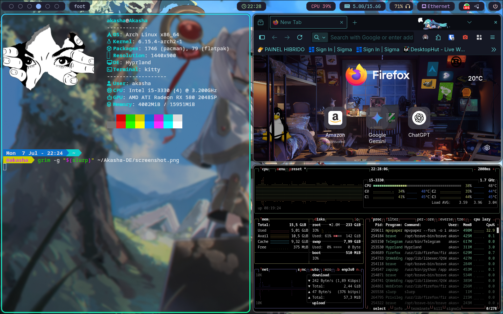

# Akasha DE

*Um ambiente de desktop adaptativo e focado em produtividade, construído sobre Hyprland e Arch Linux.*

## Principais Características

🎨 **Tema Dinâmico:** Utiliza `matugen` para gerar uma paleta de cores harmoniosa em tempo real a partir do papel de parede, aplicando-a de forma consistente em todos os elementos da interface (terminal, barra de status, lançador de apps).

⚡ **Workflow Otimizado:** Centrado em um gerenciador de janelas tiling (Hyprland) e controlado primariamente por atalhos de teclado, eliminando a necessidade do mouse para tarefas comuns e agilizando o fluxo de trabalho.

🔩 **Arquitetura Modular:** A configuração é totalmente modular, o que facilita a manutenção, personalização e a portabilidade do ambiente.

🛠️ **Ferramentas Customizadas:** Inclui um lançador de aplicativos e um menu de energia construídos do zero com Rofi, adaptados especificamente para as necessidades do meu workflow.

## Componentes

* **OS:** Arch Linux
* **Window Manager:** Hyprland
* **Barra de Status:** Waybar
* **Terminal:** Kitty
* **Lançador de Apps:** Rofi
